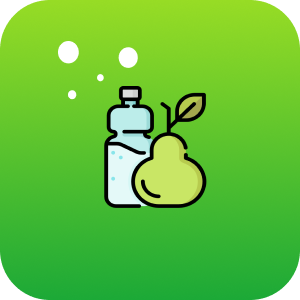
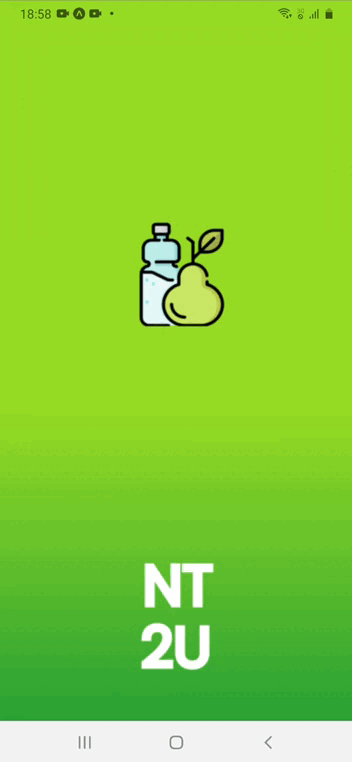

# Nutri2u

Nutri2u é um aplicativo voltado para área de nutrição, tanto profissionais podem usar durante o seu dia a dia de trabalho com seus clientes, como qualquer usuário pode acessar para realizar sua avaliação física.

Entre as avaliações físicas que o aplicativo realiza estão: IMC - índice de Massa Corporal / TMB - Taxa de Metabolismo Basal.

<h1>Icon</h1>

  

<h1>Gif</h1>

 
  
  <h1>Linguagens</h1>

  
  
  
  
 

